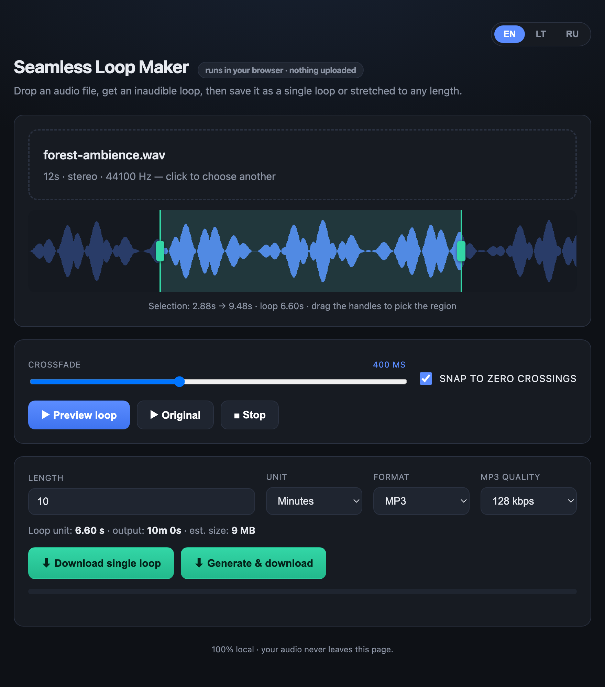

# Seamless Loop Maker

Drop an audio file, get an **inaudible seamless loop**, then save it as a single loop or stretched to any length — seconds, minutes, or hours. Everything runs **locally in your browser**; your audio is never uploaded anywhere.

### ▶️ [Open the app →](https://lukaskornis.github.io/seamless-loop/)



## Features

- **Drag & drop** any audio the browser can decode — WAV, MP3, OGG, FLAC, M4A…
- **Pick the loop region** — drag two handles over the waveform to select exactly the segment you want to loop; everything outside the selection is dimmed and a live readout shows the start/end/length.
- **Equal-power crossfade loop** — folds the tail back over the head so the end → start transition is click-free, with an adjustable crossfade (default **400 ms**) and optional **zero-crossing snap**.
- **Live preview** — loop the result instantly and A/B it against the original.
- **Export a single loop** — the tiny seamless unit, perfect for game engines, web players, or anything that loops natively.
- **Export any length** — repeat the loop to fill a target time entered in **seconds / minutes / hours** (8 h is no problem).
- **MP3 or WAV** output, with a live file-size estimate before you commit.
- **Three languages** — English, Lietuvių, Русский (auto-detected, switchable, remembered).

## How to use

1. Open the [app](https://lukaskornis.github.io/seamless-loop/) and drop in an audio file.
2. **Drag the two handles** over the waveform to select the segment you want to loop.
3. Adjust the **Crossfade** slider and hit **Preview loop** until the seam is inaudible.
4. Either **Download single loop**, or set a **Length** + **Format** and click **Generate & download**.

## Why it's seamless

The loop unit is built with an equal-power crossfade: the last *f* milliseconds are blended over the first *f* milliseconds so that, when the clip repeats, the boundary lands on consecutive samples from the original — no click, no pop. Optional zero-crossing snap aligns the loop edges for even cleaner results.

## Privacy

100% client-side. The file is decoded, processed, and encoded entirely in your browser using the Web Audio API and an inlined MP3 encoder ([lamejs](https://github.com/zhuker/lamejs)). Nothing is sent to a server.

## Tech

A single self-contained `index.html` — no build step, no dependencies to install. It works offline if you just open the file, and is hosted as-is on GitHub Pages.

### Run locally

```bash
# any static server works, e.g.
python3 -m http.server 8000
# then open http://localhost:8000
```

…or simply double-click `index.html`.
